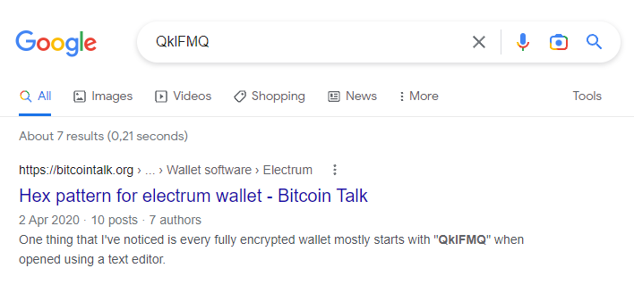
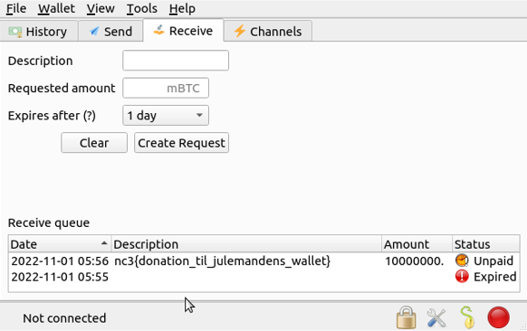

# NC3 Writeup
## Juledonation

    file wallet
Giver

    wallet  ASCII text, with very long lines (3656), with no line terminators
Hvilket ikke er super brugbart. Men efter at google de første seks karakterer af filen, ser det ud af at filen er en Electrum wallet. Efter at downloade og åbne filen med Electrum, viser det sig desværre filen er krypteret og kræver et kodeord for at blive dekrypteret.
Heldigvis findes der et script btcrecover https://github.com/gurnec/btcrecover som kan lave en dictionary password attack, på mange forskellige cryptocurrencies wallet formats, heriblandt Electrum. Password filen rockyou.txt plejer at være det første man forsøger med i en typisk CTF opgave

    python3 btcrecover.py --wallet wallet --passwordlist rockyou.txt
Giver

    Password found: 'julemanden007'

Efter at indtaste kodeordet i Electrum, får jeg endelig adgang til min bitcoin adresse dog med en saldo på 0 bitcoins. I stedet får jeg et flag som ses under fanen Receive.

## et-nul

    0110000110011111100011111110000111101111111101111111100000000011000011011000001101100000000000000011111111011110110000000000000001100001101111001111110001111110011111111011000011011110111100011100011011000011011000001100110000110000000000110000000000001110001101100000110110000000000000000001100000110011000000000000000111000110011001100001101100001101100000001110001101111000011001111001101100000000000000110011000011000000000011000000000000111100110110000011011000000000000000000110000011001100000000000000011110011001100110000000110000000110000000111100110111100001100110110110110000000011111110011100001111110000001100000000000011011011011000001101100000000000000000011000001100110000000000000001101101100110001111110001111110011111100011011011001100000111011001111011000000000000001100110000110000000000110000000000001100111101100000110110000000000000000001100000110011000000000000000110011110011000000001100000001101100000001100111100000000011001100011101100001101100000110011000011000000000011000000000000110001110110000011011000000000000000000110000011001100000000000000011000111001100110000110110000110110000000110001110111100001100110000110011111100011111110000111101111111100001100001111111011000011001111111001111111101111111000011000011110111111110111111101100001101111001111110001111110011111111011000011011110111100
    
Den første tanke var at prøve at konventere filen til binary, men der kom ikke rigtig noget frem med det. Måske det slet ikke var noget filformat. Et filformat vi typisk aldrig have så mange nummer efterfulgt af hinanden, pga. unødvendig redundans. 
Rigtig mange steder i filen havde præcist 18 nuller ("000000000000000000"), måske det var ASCII ART. Efter er lave et hurtigt Python script, og med lidt trial and error kom flaget frem:

    f = open('et-nul', 'r').read().replace('1', '■').replace('0', '.')

    def formatter(lineLength):
        print("lineLength = {0}".format(lineLength))
        for i in range(len(f)):
            k = f[i]
            

            if i % lineLength == 0 and i != 0:
                print()

            print(k,end='')
        print("\n"*3)

    for i in range(50, 400):
        formatter(i)

## Banke på

Vi er givet et ELF (executable) binary, som tager en streng, og krypterer hver enkelt karakter til et tal mellem 0 og 65535. Denne krypterede karakter er et Dst port i en UDP PACKET, som bliver sendt til 127.0.0.1. Opgaven giver os en PCAPNG fil, som i princippet er cipher-tekst. I stedet for at reverse krypterings-algoritmen fra ELF-filen, kan man bare brute force ved at køre ELF-binary med karakter ad gangen, indtil det passer med PCAPNG filen. Dette kan kun gøres fordi det er en simpel stream cipher, hvor hver karakter er krypteret uafhængigt af hinanden. 

    import subprocess
    import json
    from pcapng import FileScanner

    packets = []
    with open('banke-paa.pcapng', 'rb') as fp:
        scanner = FileScanner(fp)
        for block in scanner:
            packets.append(block)        
    packets = packets[3:]

    UDP_packets = []
    for i in range(len(packets) // 2):
        block = packets[i*2]
        a = block.packet_data[-17] # bedste UDP parser ever
        b = block.packet_data[-18]
        UDP_packets.append(a  + b * 256)

    flag = ""

    for i in range(len(UDP_packets)):
        for k in range(32, 128):
            flag_candidate = flag + chr(k)
            encrypted_char = int(subprocess.run(["./banke-paa", flag_candidate, "127.0.0.1"], capture_output=True).stdout.decode("utf-8").split('\n')[-2].split(':')[1].strip())
            if encrypted_char == UDP_packets[i]:
                temp = flag_candidate
                continue
                
        flag = temp
        print(flag)

Giver:

    n
    nc
    .
    .
    .
    nc3{julemanden banker aldrig paa
    nc3{julemanden banker aldrig paa!
    nc3{julemanden banker aldrig paa!}
